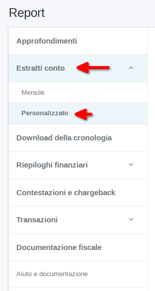

# ofxstatement-paypal

### Paypal plugin for ofxstatement 

This project provides a custom plugin for [ofxstatement](https://github.com/kedder/ofxstatement) for Paypal. It is based
on the work done by gerasiov (https://github.com/gerasiov/ofxstatement-paypal/).

`ofxstatement`_ is a tool to convert proprietary bank statement to OFX format, suitable for importing to GnuCash / Odoo. Plugin for ofxstatement parses a particular proprietary bank statement format and produces common data structure, that is then formatted into an OFX file.

Users of ofxstatement have developed several plugins for their banks. They are listed on main [`ofxstatement`](https://github.com/kedder/ofxstatement) site. If your bank is missing, you can develop your own plugin.

## Installation

### From PyPI repositories
```
pip3 install ofxstatement-paypal
```

### From source
```
git clone git@github.com:EtsBIZ4Africa/ofxstatement-paypal.git 
python3 setup.py install
```

### Configuration

You have to configure some parameter in your local environment to allow the conversion.

To edit the config file, run this command:

```bash
$ ofxstatement edit-config
```
It's open a `vim` editor with current configuration.

Now add plug-in configuration, here is example with the default configuration:

```ini
[paypal-ng]
plugin = paypal-ng
encoding = utf-8
dataformat = %%d/%%m/%%Y
default_account = Paypal Personal
```

Now, base on your country, edit:

- `dataformat`:  open your PayPal CSV and see your specific data-format.
  - `%%d/%%m/%%Y` is Europe standard.
  - `%%m/%%d/%%Y` is USA standard.
  - etc...
- `default_account`:  is text string, add on the beginning of the OFX file, help some program, like [Home Bank](http://homebank.free.fr/en/index.php), to detect witch account is used and help in import phase.

## Usage

From Paypal Web interface, download a CSV of  `Bank statements` with the personalized report period you wish. (PayPal Login :arrow_right: History  :arrow_right: Download :arrow_right: customized)



Finally, open terminal in the directory where you download the report and type:

```
$ ofxstatement convert -t paypal-ng input.csv output.ofx
```

### Add Alias
To simplify the use of the plugin, we strongly recommend adding an alias to your system (if in a Linux environment or on an emulated terminal) by adding the alias of this command to your *.bash_aliases*:
```bash
$ printf '\n# Paypal CSV convert to OFX format\nalias ofxPaypal="ofxstatement convert -t paypal-ng"\n' >> ~/.bash_aliases
```
After that, reload your terminal (close and then reopen) and the usage change to:
```bash
  $ ofxPaypal Paypal.csv Paypal.ofx
```
**Note**: If after reload alias are not loading, go in your *.bashrc* and check if follow line are present, if not, add it on the end:
```bash
  # Alias definitions.
  # You may want to put all your additions into a separate file like
  # ~/.bash_aliases, instead of adding them here directly.
  # See /usr/share/doc/bash-doc/examples in the bash-doc package.

  if [ -f ~/.bash_aliases ]; then
      . ~/.bash_aliases
  fi
```


## How use OFX file after conversion

The `ofx` format stands for '*Open Financial Exchange*', it can be used to transfer your accounting records from one database to another.
Once you have the `ofx` file, you can use any program to manage your finances.
Among the many available, a non-exhaustive list of open source products is:

- [HomeBank](http://homebank.free.fr/en/index.php), continuously updated program, present everywhere except in smartphones, with many beautiful ideas and listening to the community. **100% compatibility** 
